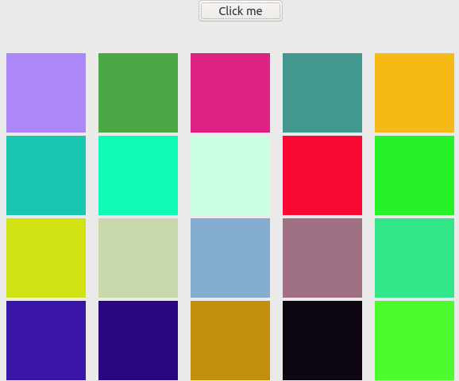

## Training Javascript

### Exercise 1 -> random/random-color-square.html

Create a button that inserts squares into the page and, when the mouse goes over it, changes the background to a random color.

