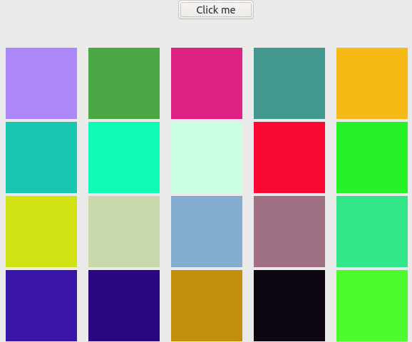
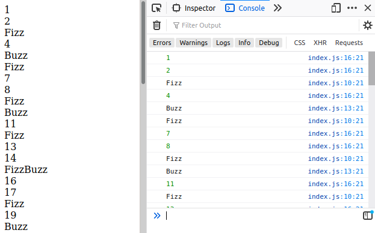
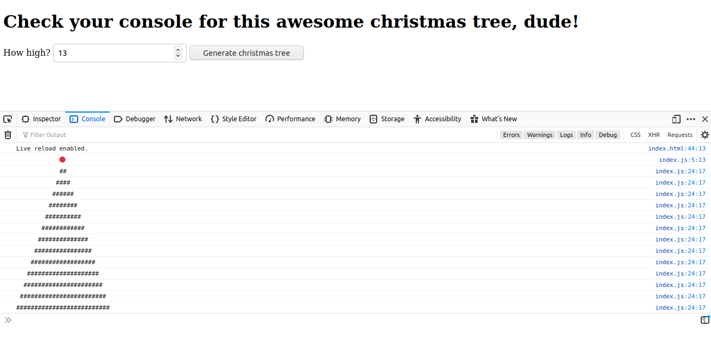

## Training Javascript

### **Exercise 1** -> random/random-color-square.html

Create a button that inserts squares into the page and, when the mouse goes over it, changes the background to a random color.

 
 

### **Exercise 2** -> classic fizzBuzz

Print a sequence of _n_ numbers, but when the number:

- is evenly divisible by 3, print 'Fizz'
- is evenly divisible by 5, print 'Buzz'
- is evenly disible by both 3 and 5, print 'FizzBuzz'

 
 

### **Exercise 3** -> array sum

Write a function that returns the sum of an array of integers.

### **Exercise 4** -> minimum and maximum sums

For an array of _n_ integers, write a function that returns the smallest and the greatest sums possible using _n-1_ integers of the array.

### **Exercise 5** -> diagonal difference

Write a function that calculates the sums of the diagonals of any matrix given and returns the absolute difference between them.

### **Exercise 6** -> staircase/christmas tree

Write a function that prints a staircase made of spaces and hashes # with _n_ steps.

As a bonus, I've converted it to a christmas tree 🎄

